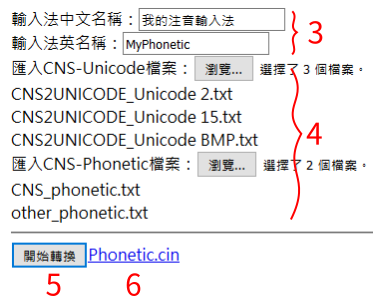

## 概觀

1. 這個工具可以讀取全字庫「CNS-Unicode對照表」與「CNS-注音對照表」，並輸出cin檔案。
2. 可以自行添加輸入檔案(必須符合全字庫格式)。
3. 顯示例外情形，可以提供相關單位做資料的檢查。

## 使用方式

1. 將CinConvert.html及FileRead.js放到同一個資料夾。
2. 用瀏覽器打開CinConvert.html。
2. 輸入希望顯示的輸入法名稱。
3. 匯入兩種類型的文字文件。(用shift跟ctrl可複選檔案)
4. 按下開始轉換後，會在按鈕旁邊產生cin檔的下載連結。
5. 點連結將檔案儲存到電腦。

※ CNS_phonetic.txt、CNS2UNICODE_Unicode 2.txt、CNS2UNICODE_Unicode 15.txt、CNS2UNICODE_Unicode BMP.txt等檔案可至[政府資料開放平台-CNS11643](http://data.gov.tw/node/5961)下載。  
※ 已測試瀏覽器：Firefox、Chrome、Edge。
